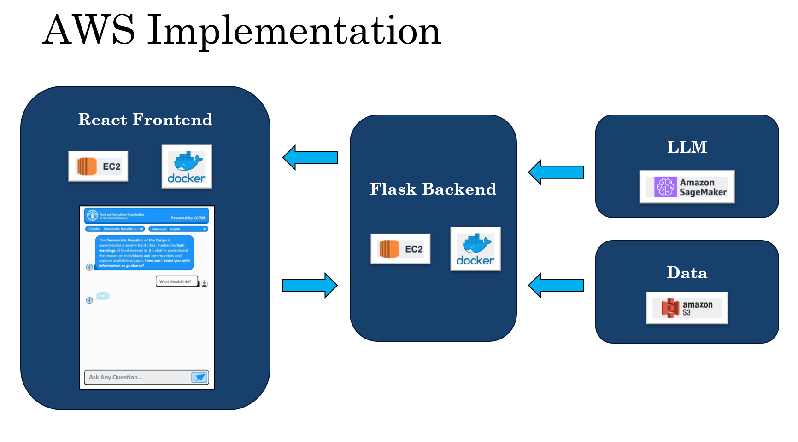

# Food-Cost-Warning-Prediction-App
This repo contains the code for deploying a chat-bot web application for interacting with stored predictions of the severity of future price spikes in food markets. The price spike severity data was generated by the MSOE Research Team NourishNet using their food market prediction and classification models. .   

## Installation and Documentation for Chatbot API

### Installation Steps:

1. **Setting up EC2 Instance:**
    Launch an EC2 instance on AWS with appropriate configurations.
    Ensure that the instance has necessary permissions to access S3 buckets.

2. **Setting up Docker Containers:**
    Install Docker on your EC2 instance.
    Pull the necessary Docker images for React frontend, Flask backend, and Nginx.
    Build and run Docker containers for both frontend and backend.

3. **Configuring S3 Bucket:**
    Create an S3 bucket to store data files.
    Ensure proper access control settings for the bucket.

4. **Deploying Flask Backend:**
    Copy the Flask backend code to your EC2 instance.
    Install dependencies using pip install -r requirements.txt.
    Run the Flask application using Gunicorn.

5. **Deploying React Frontend:**
    Copy the React frontend code to your EC2 instance.
    Build the React app using npm.
    Serve the built files using Nginx.*

## API Documentation:

1. **OpenAI-based Chatbot Endpoint:**
    * Endpoint: `/api/send-message`
    * Method: POST
    * Parameters:
        * `message`: User's message (string)
        * `nation`: Selected country (string)
        * `language`: Selected language (string)

2. **SageMaker-based Chatbot Endpoint:**
    * Endpoint: `/api/send-message-sagemaker`
    * Method: POST
    * Parameters:
        * `message`: User's message (string)
        * `nation`: Selected country (string)
        * `language`: Selected language (string)

3. **Prometheus Endpoint for Metrics**
    * Endpoint: `/metrics`
    * Method: POST
    * Purpose: Exposes metrics for monitoring and scraping by Prometheus

## Simple Use Cases

* **User Interaction Flow:**
    User interacts with the React frontend.
    Enters a message, selects a country, and chooses a language.
    Sends the message to the desired endpoint based on the backend implementation (OpenAI or SageMaker).

* **Backend Processing (OpenAI):**
    Backend receives the message along with country and language parameters.
    Retrieves relevant data from the S3 bucket based on the selected country.
    Sends the message along with the chat history to OpenAI for processing.

* **Backend Processing (SageMaker):**
    Backend receives the message along with country and language parameters.
    Prepares the input data and sends it to the SageMaker endpoint hosting the chatbot model.
    Receives the response from SageMaker and returns it to the frontend.

* **Frontend Display:**
    Frontend displays the user's message and the bot's response in the conversation interface.
    Optionally displays any additional data retrieved from the backend (e.g., food price warning).

## Future Improvements

* Implement error handling for API requests and responses.
* Enhance user interface with more interactive features.
* Implement caching mechanisms for improved performance.
* Implement user authentication and session management.
* Explore more advanced AI models and integration options for enhanced conversational capabilities
